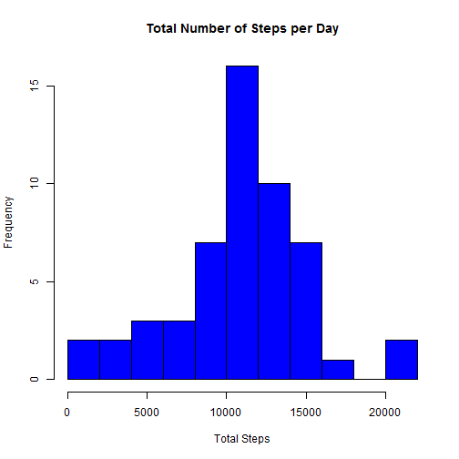
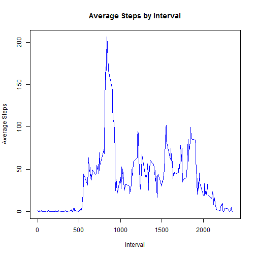
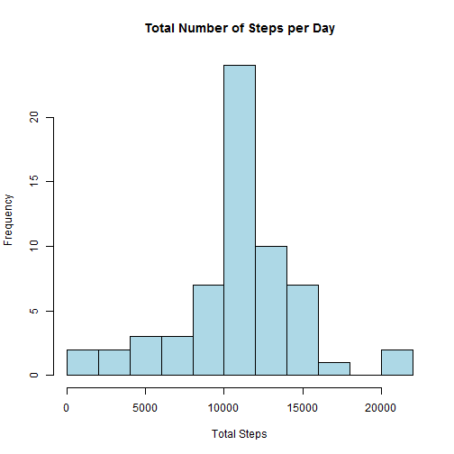
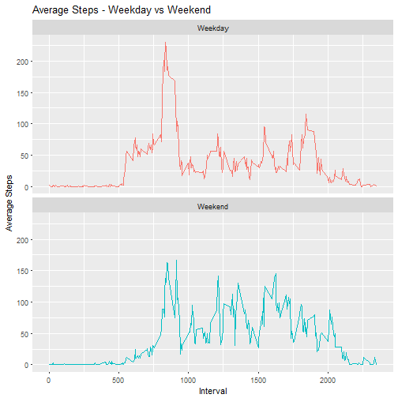

```r
---
title: "Reproducible Research Assignment 1"
author: "Katrina Shanley"
date: "24 March 2017"
output: html_document
---

## Loading and preprocessing the data

First prepare the environment.
```

```
## Error: <text>:10:7: unexpected symbol
## 9: 
## 10: First prepare
##           ^
```

```r
library(ggplot2)
library(knitr)
```

Download, unzip and read in the data.

```r
filename <- "getdata_dataset.zip"
if (!file.exists(filename)){
    fileURL <- " "
    download.file("https://d396qusza40orc.cloudfront.net/repdata%2Fdata%2Factivity.zip",
                  filename)
}  
if (!file.exists("activity.csv")) { 
    unzip(filename) 
}

activity <- read.csv("activity.csv", stringsAsFactors = FALSE)
```

Pre-process the data by formatting dates and creating a second dataset with NAs removed.

```r
activity$date <- as.Date(activity$date) 
activitycomplete <- activity[complete.cases(activity),]
```

## What is mean total number of steps taken per day?

Calculate the total steps taken per day.

```r
total <- tapply(activitycomplete$steps, activitycomplete$date, sum)
```

Plot the histogram for total steps per day.

```r
hist(total, 10, col="blue", main="Total Number of Steps per Day", xlab="Total Steps")
```



Calculate mean daily steps.

```r
mean(total)
```

```
## [1] 10766.19
```

Calculate median daily steps.

```r
median(total)
```

```
## [1] 10765
```


## What is the average daily activity pattern?

Calculate the average steps taken per 5 minute interval.

```r
intervals <- tapply(activitycomplete$steps, activitycomplete$interval, mean)
```

Plot line chart of average steps per interval.

```r
plot(y=intervals, x=names(intervals), type="l", col = "blue",
     main="Average Steps by Interval",
     xlab = "Interval", ylab = "Average Steps")
```



Calculate the interval with maximum average steps.

```r
intervals[intervals==max(intervals)]
```

```
##      835 
## 206.1698
```

## Imputing missing values

Calculate the number of missing values.

```r
sum(is.na(activity))
```

```
## [1] 2304
```

Create a new dataset to impute missing values using the mean number of steps per interval.

```r
activitynew <- activity
nas <- is.na(activitynew$steps)
activitynew$steps[nas] <- intervals[as.character(activitynew$interval[nas])]
```

Calculate the total steps taken per day with missing values imputed.

```r
totalnew <- tapply(activitynew$steps, activitynew$date, sum)
```

Plot the histogram for total steps taken per day with missing values imputed.

```r
hist(totalnew, 10, col="light blue", main="Total Number of Steps per Day", xlab="Total Steps")
```



Calculate the mean steps taken per day with missing values imputed.

```r
mean(totalnew)
```

```
## [1] 10766.19
```

Calculate the median steps taken per day with missing values imputed.

```r
median(totalnew)
```

```
## [1] 10766.19
```

## Are there differences in activity patterns between weekdays and weekends?

Create a new value for weekday type.

```r
activitynew$day <- ifelse(weekdays(activitynew$date)=="Saturday"|
                          weekdays(activitynew$date)=="Sunday", "Weekend", "Weekday")
```

Calculate the total steps for each interval by weekday type.

```r
weekday <- with(activitynew, aggregate(steps, by=list(day, interval), mean))
colnames(weekday) <- c("Day", "Interval", "Steps")
```

Create the panel plot for weekday breakdown.

```r
ggplot(weekday, aes(x=Interval, y=Steps, color=Day)) + 
       geom_line() + facet_wrap(~Day, ncol=1, nrow=2) +
       labs(title="Average Steps - Weekday vs Weekend", y="Average Steps") +
       theme(legend.position = "none")
```



The plot shows that there is increased activity on weekday mornings, however overall activity throughout the day is higher on weekends.
```

